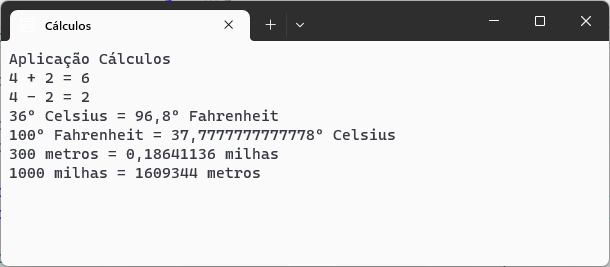

# Cálculos :1234:
 Aplicação c# para efetuar diversos tipos de cálculos.

Desenvolvida noâmbito da ação de formação **Introdução ao Git e GitHub**

## Operações suportadas
Neste momento esta aplicação inplementa as seguintes operações:

- soma
- subtração
- conversão de temperaturas
    - celsius --> fahrenheit
    - fahrenheit --> celsius
- conversão distâncias
    - metros --> milhas
    - milhas --> metros

## Tecnologias utilizadas neste projeto
- Visual Studio
- c#
- Git
- GitHub Desktop
- Plataforma GitHub

